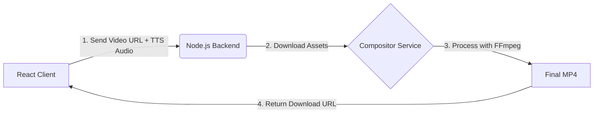

# Proposal: Server-Side Compositor Service

## Rationale and Motivation

The "Santa Wishing Machine" aims to deliver a magical, personalized video message from Santa. To achieve this, we are leveraging two distinct generative AI technologies:

1.  **Google Veo (Video):** Generates high-fidelity, cinematic video clips. However, these are currently limited to short durations (typically ~8 seconds) and, while they may contain ambient sound (like a crackling fire), they do not contain specific speech.
2.  **Gemini TTS (Audio):** Generates the "Voice of Santa" reading a personalized letter. This audio is variable in length (often 30-60 seconds) and drives the narrative of the experience.

**The Problem:**
We have a disjointed experience: a stunning but short video loop and a long, engaging audio track. Simply playing them side-by-side on a webpage is fragile (sync issues) and hard to share (users can't just "save video" to send to a child). Furthermore, replacing the video's audio track entirely with the voiceover eliminates the rich ambient sound effects that Veo produces, making the scene feel "dead" and artificial.

**The Goal:**
We need to fuse these two assets into a single, cohesive artifact: **a standalone video file**. This video must:
*   **Extend** the short visual clip to match the longer narrative audio.
*   **Blend** the immersive ambient sounds of the video with the clear voice of Santa.
*   **Deliver** a standard MP4 file that is easily shareable on any platform.

---

## Executive Summary
We propose adding a server-side media processing capability to the Santa Wishing Machine. This will allow us to automatically combine the 8-second visual generation (Veo) with the longer, variable-length personalized voiceover (Gemini TTS) into a single, shareable video file.

## The Challenge
*   **Duration Mismatch:** Veo generates fixed 8-second clips. The personalized "Letter from Santa" voiceover is typically 30-60 seconds long.
*   **Audio Complexity:** Veo videos often contain valuable ambient sound effects (crackling fire, wind) that contribute to the atmosphere. Simply overwriting the audio track with TTS would destroy this immersion.

## The Solution: "Option A" - Server-Side Compositor
We will implement a dedicated **Compositor Service** within our existing Node.js backend. This service will utilize **FFmpeg**, the industry-standard multimedia framework, to intelligently merge the assets.

### Key Features
1.  **Smart Looping:** The 8-second Veo clip will be looped seamlessly to match the exact duration of the TTS voiceover.
2.  **Audio Mixing (Ducking):**
    *   **Foreground:** Santa's Voice (TTS).
    *   **Background:** Veo Ambient Sound.
    *   **Effect:** The ambient sound will be preserved but mixed underneath the voice, ensuring Santa is heard clearly without losing the "crackling fire" atmosphere.
3.  **Automatic Trimming:** The final video will automatically cut exactly when the voiceover finishes, creating a polished final product.

### Architecture Data Flow



## Implementation Plan

### 1. Infrastructure Changes
*   **Docker:** Update `Dockerfile` to install `ffmpeg` (using `apk add ffmpeg` for Alpine Linux). This ensures the capability exists in our deployed environment.

### 2. Backend Dependencies
*   Add `fluent-ffmpeg` to `package.json`. This provides a clean, robust JavaScript interface for controlling FFmpeg, preventing "spaghetti code" string concatenation.

### 3. New Service Module (`services/compositor.js`)
We will create an isolated service module to handle the complexity.

**Proposed Logic:**
```javascript
// Conceptual Logic
ffmpeg()
  .input(videoPath).inputOptions(['-stream_loop -1']) // Loop video infinitely
  .input(audioPath)                                   // TTS Audio
  .complexFilter([
    // Mix audio streams, potentially lowering video background volume
    '[0:a]volume=0.3[bg];[bg][1:a]amix=inputs=2[a_out]' 
  ])
  .outputOptions(['-shortest']) // Stop when the shortest input (Audio) ends
  .save('output.mp4');
```

### 4. API Integration
*   New Endpoint: `POST /api/composite`
*   Handles temporary file storage (downloading the Veo asset, saving the TTS buffer) and orchestrates the cleanup after processing.

## Advantages
*   **Quality:** Produces a professional-grade output that client-side solutions (WASM) struggle to match.
*   **Simplicity:** Keeps the frontend code lightweight and focused on UI.
*   **Reliability:** Server-side processing is more stable and consistent across different user devices (mobile/desktop).

## Risk Assessment
*   **Processing Time:** Video encoding is CPU intensive. We will mitigate this by using the "ultrafast" preset for encoding, prioritizing speed over file size for this prototype.
*   **Storage:** Requires temporary disk space. We will implement aggressive cleanup routines to delete files immediately after the request completes.